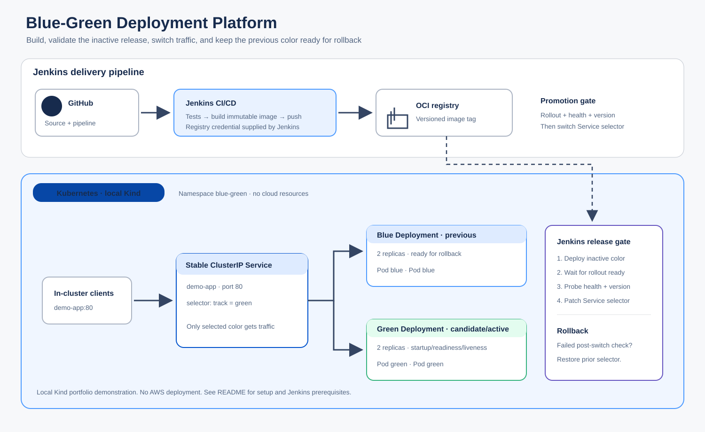

# Blue-Green Deployment Platform

A local-first project demonstrating immutable releases, inactive-color rollout, health gates, a Kubernetes Service traffic switch and selector rollback.



GitHub → Jenkins test/build → OCI registry → inactive Kubernetes Deployment → health/version checks → ClusterIP Service selector switch. Blue and green each have two replicas; the previous color remains available. This is a portfolio demonstration, not an AWS or production deployment. No cloud resources are created.

## Local Kind workflow

Requirements: Docker, Kind, kubectl, Node.js 22+, curl.

```sh
npm test
./scripts/local-up.sh
```

Inspect the active color and pods:

```sh
kubectl --context kind-project6 -n blue-green get svc demo-app -o jsonpath='{.spec.selector.track}{"\n"}'
kubectl --context kind-project6 -n blue-green get deployments,pods
kubectl --context kind-project6 -n blue-green port-forward svc/demo-app 8080:80
```

Then run `curl http://127.0.0.1:8080/version`. To promote another local release:

```sh
docker build -t demo-app:local .
kind load docker-image demo-app:local --name project6
KUBE_CONTEXT=kind-project6 IMAGE=demo-app:local VERSION=local-2 ./scripts/promote.sh
```

Delete the disposable cluster with `kind delete cluster --name project6`. Promotion rejects non-Kind context names.

## Jenkins

`Jenkinsfile` expects a `docker-kubectl-node` agent with Node.js, Docker, kubectl, curl and the named Kind context. Add a username/password credential named `container-registry`; configure `IMAGE_REPOSITORY` to a writable registry repository. No credentials are committed. `KUBE_CONTEXT` defaults to `kind-project6` and must exist on the agent.

## Files

- `app/`, `test/` — demo service and endpoint tests
- `k8s/` — blue/green Deployments and stable Service
- `scripts/` — local setup and guarded promotion
- `architecture/` — design notes
- `docs/interview-guide.md` — trade-offs and discussion
