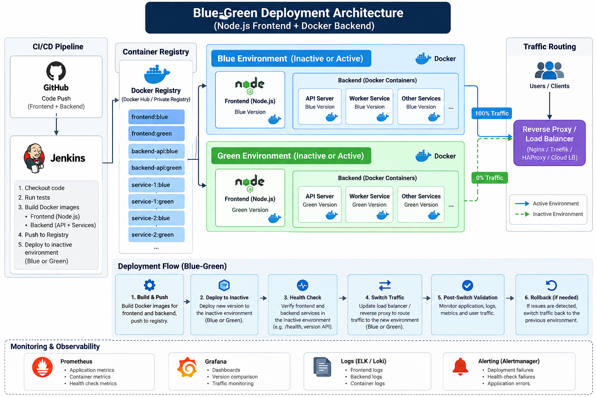

# Blue-Green Deployment Platform

A Docker-first blue-green release demonstration. Jenkins tests the Node.js frontend and backend, builds and pushes versioned images, deploys the inactive Docker Compose environment, verifies its frontend/API/services, then reloads Nginx to switch traffic. If post-switch checks fail, the proxy configuration is restored to the previous environment.



## Architecture

- Blue and green are independent Compose stacks: Node.js frontend, API, catalog service and billing service in each color.
- The frontend calls its same-color API; the API checks its same-color backend services.
- Nginx is the only published application entry point. `proxy/conf.d/active.conf` selects the frontend receiving client traffic.
- The Docker API here is the application HTTP API. Containers do not mount or control the host Docker socket.
- This is a local-first portfolio implementation. It does not deploy AWS infrastructure and does not use Kubernetes as its deployment mechanism.

## Run locally

Requirements: Docker Engine with the Compose plugin, Node.js 22 or newer, and curl.

```sh
npm test
./scripts/local-up.sh
curl http://127.0.0.1:8080/version
```

The first start builds local frontend/backend images and starts both colors plus Nginx. The initial proxy route is blue. Deploy a new release to the inactive color; only after its frontend, API, catalog and billing endpoints pass validation does Nginx switch traffic:

```sh
VERSION=release-2 ./scripts/deploy-inactive.sh
curl http://127.0.0.1:8080/version
```

To switch back manually, validate and route to the other color:

```sh
./scripts/switch-traffic.sh blue
```

Stop the local stack with `docker compose down`. See [architecture/architecture.md](architecture/architecture.md) and [docs/interview-guide.md](docs/interview-guide.md).

## Jenkins and registry

`Jenkinsfile` expects a Jenkins agent on the same Docker host and persistent checkout workspace as the Compose stack, with Docker Compose, Node.js, and access to the project and proxy config. Bootstrap the local stack once from that Jenkins workspace with `./scripts/local-up.sh` before running a pipeline build; this gives Nginx a bind mount to the same `active.conf` that the deploy script updates. Configure a Jenkins username/password credential named `container-registry`, and set the `REGISTRY_REPOSITORY` parameter to a namespace where it can push. Jenkins logs in through stdin, publishes immutable build-number tags, and invokes the same guarded deploy/validation/switch scripts. Credentials are not stored in this repository.

For local builds, `deploy-inactive.sh` builds images itself. Jenkins sets `PULL_IMAGES=true` so the candidate uses the images already pushed to the registry.

## Health and release identity

Each Node container has a Docker health check. Frontend `/health` checks its same-color API; API `/health` checks catalog and billing. `/version` returns color and release identity, including the versions of downstream services. Candidate validation checks the complete color before traffic changes, then checks the public Nginx route. Failed candidate checks leave traffic untouched; failed post-switch checks restore the previous Nginx upstream and reload.
